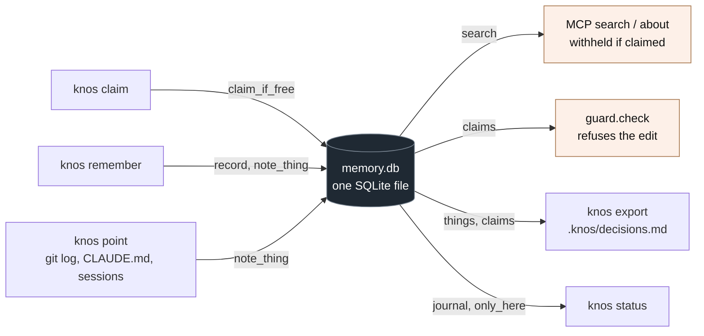
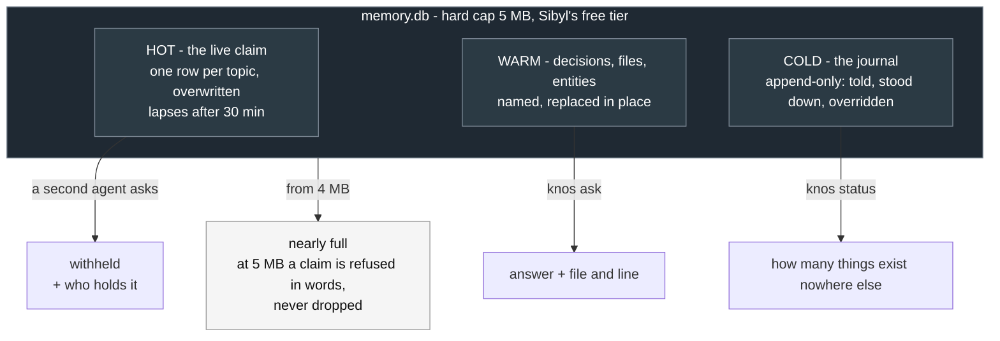
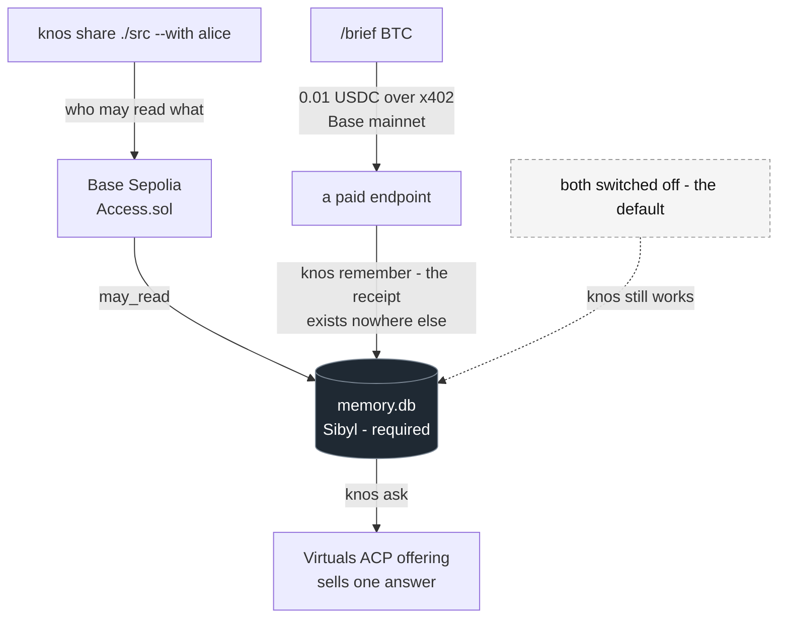
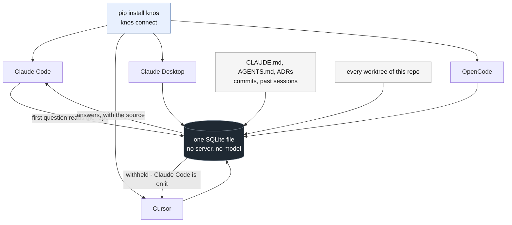

# Knos

<!-- mcp-name: io.github.drexthealpha/knos -->

[](https://glama.ai/mcp/servers/drexthealpha/Knos)

**Coordination for repos with more than one agent in them. Two contributors,
or two agents, change the same thing without knowing it. Knos is the record
of who is on what — and it refuses to answer about work somebody else has
already taken.**

Take it in whichever shape you already wanted. **Nothing here asks you to
install Knos to try it.**

## Start here: the Action

Zero install for the repo. One file, no dependency added to your project, and
it never fails a build:

```yaml
# .github/workflows/knos-claims.yml
on: [pull_request]
permissions: { contents: read, pull-requests: write }
jobs:
  claims:
    runs-on: ubuntu-latest
    steps:
      - uses: actions/checkout@v4
      - uses: drexthealpha/Knos/action@v0.1.6
```

That is the whole of it. It reads `.knos/decisions.md` — an ordinary file
committed to your repo — and comments on a pull request when the branch
touches work somebody has claimed, or a decision already recorded. Nothing is
blocked and nothing is required: **it exits 0 on every path, including every
failure path and every unexpected one**
([`tests/test_shared_repo.py -k never_returns_non_zero`](tests/test_shared_repo.py)).

The tag is pinned rather than a branch, so what runs in your CI is a fixed
file you can read first: `git show v0.1.6:action/knos_pr_check.py`. It is
standard library only. You can watch it having run rather than take this on
trust — it fired on
[pull request #1](https://github.com/drexthealpha/Knos/pull/1) here, matched a
standing claim, named who held it, and exited 0.

**Agents are optional.** The file can be written by hand. If nobody on the
repo ever runs an agent, the Action still tells two humans they are about to
land the same change twice.

## Or embed it: the claim, as a library

If you would rather have the behaviour inside the tool you already ship than
run anything of ours, import it. No MCP, no CLI, no daemon:

```python
from knos.core import Claims

with Claims(repo=".", who="my-agent") as claims:
    taken, holder = claims.take("the risk guard")
    if not taken:
        return claims.withheld("the risk guard")   # the refusal, in words
```

`take` is the compare-and-swap that lets exactly one of two agents win the
same work in the same second. The hold is bound to the session you pass, not
to the name — an agent that calls itself the holder is still refused. Claims
lapse on their own after 30 minutes, so a crashed agent cannot hold work for
ever. [`src/knos/core.py`](src/knos/core.py),
[`tests/test_core.py`](tests/test_core.py).

**This is the preferred way to adopt Knos.** Native inside your tool, or the
Action in your repo. The standalone server below is the third option, not the
first one.

## Or run it as a server, if you already run several agents

`pip install knos && knos connect` puts it in front of Claude Code, Claude
Desktop, Cursor and OpenCode as an MCP server, and `knos guard --install`
makes the refusal reach the edit itself. That is the power-user path and it is
documented in full further down; it is worth it when you personally have three
agents open on one tree, and overkill when you do not.

## Judging this in five minutes

[**docs/JUDGE_GUIDE.md**](docs/JUDGE_GUIDE.md) maps every claim to a file, a
test or a live artifact, and states the limits plainly.
[**docs/VERIFICATION.md**](docs/VERIFICATION.md) is the same list with the
commands and explorer links that settle each one.
[**docs/ARCHITECTURE.md**](docs/ARCHITECTURE.md) and
[**docs/MEMORY_MODEL.md**](docs/MEMORY_MODEL.md) are how it is built and what
lives in each Sibyl tier. [**docs/PMF.md**](docs/PMF.md) is the evidence
ledger, including what it is not.

The whole argument is one command:

```bash
python scripts/ablation.py
```

| Arm | Store present | Store deleted |
|---|---|---|
| **Reversed decision: an edit resting on it** | **refused 12/12** | nothing is held |
| **Reversed decision: a purchase resting on it** | **refused 12/12** | nothing is held |
| **Reversed decision: the same edit after reconsidering** | **allowed 12/12** | - |
| **Spend: the same request a second time** | **paid again 0/12** | **paid again 12/12** |
| **Spend: the same request while somebody holds it** | **refused 12/12** | no claim survives |
| Withhold: a second agent asks about claimed work | refused **12/12** | refused **0/12** |
| Guard: an edit to claimed work | refused **12/12** | refused **0/12** |
| Action: a pull request touching a claimed topic | commented **12/12** | commented **0/12** |
| Paid: a bought answer, found by the next agent | kept **12/12** | kept **0/12** |
| **Fresh machine: a decision, before `knos restore`** | - | **lost 12/12** |
| **Fresh machine: the same decision, after `knos restore`** | - | **back 12/12** |
| **Fresh machine: the claim that must NOT come back** | - | **stayed gone 12/12** |

The first two rows are the memory deciding whether money moves. With the store,
the second identical request costs nothing. Without it, the agent pays again
every single time. And while somebody holds the topic, it refuses to spend at
all - a bought answer would be stale before it arrived, and the holder is the
cheaper place to ask.

12 trials, seed 1337, against the product's own refusal code -
[`scripts/ablation.py`](scripts/ablation.py), written to
[`docs/evidence/ablation.json`](docs/evidence/ablation.json) and pinned by
[`tests/test_ablation.py`](tests/test_ablation.py).

### What that is worth, in dollars

```bash
python scripts/spend.py
```

One ordinary day on one machine: **5 agents, 20 asks, 4 subjects.**

| | purchases | free | spent |
|---|---|---|---|
| **store present** | 4 | 16 | **$0.022** |
| **store deleted** | 20 | 0 | **$0.119** |

**5.41x more expensive without the memory.** Every verdict is a real call into
`gate.decide`, the same function the bot runs before spending. The dollars are
those verdicts times prices this agent has actually paid on Base mainnet - the
receipts are in [VERIFICATION.md](VERIFICATION.md). The multiplication is
stated rather than hidden: re-buying the same brief forty times would cost
$0.40 and prove nothing the verdict count does not.

Scale is the point rather than the cents. Four subjects and five agents is a
quiet day; the ratio is what a team pays for having no shared memory, and it
grows with every agent added.

**Memory is not a feature here, it is the mechanism.** A claim has no second
copy. Delete the store and the refusal is not degraded, it is impossible.

## Read this first

Three MCP tools over stdio, one SQLite file, no server and no network. What
makes it different from a memory is that it **refuses**: ask about work
another agent claimed and there is no answer, only who has it. With
`knos guard --install` the refusal reaches the edit itself.

**Where the memory is read and written.** One file, `~/.knos/<repo>/memory.db`,
through [Sibyl](https://github.com/Sibyl-Labs/Sibyl-Memory). Every arrow below
is a call site you can open, and
[`tests/test_sibyl_is_load_bearing.py`](tests/test_sibyl_is_load_bearing.py)
deletes the file and asserts the product stops working.



Written on the left, read on the right. Delete the box in the middle and
everything on the right stops — that is the whole of what "load-bearing"
means here, and it is a test rather than a sentence.

| Tier | What lives there | Written by | Read by |
|---|---|---|---|
| HOT | the live claim, one row per topic, overwritten | `Memory.claim_if_free` | `mcp.search`, `guard.check` |
| WARM | decisions, files, named things | `Memory.note_thing` | `answer.ask`, `knos export` |
| COLD | the journal: what you told it, who stood down, every override | `Memory.record` | `knos status`, `knos notes` |

Sibyl's five tiers are used for what they are, not as one key-value bucket:
a claim is about *now* and is overwritten, a decision is a named thing
replaced in place, and history is only ever appended to.



**Five things here that are not elsewhere.** Each one is a link, and each one
is a command or a test rather than a claim:

1. [A claim withholds the answer](#what-a-claim-does-here), instead of
   attaching a warning to it. Every other tool's claim is advisory.
2. [The guard refuses the edit](#what-it-cannot-do) in Claude Code, Cursor
   and OpenCode — through their hooks, which are not MCP.
3. [A hold is bound to the connection](docs/core-flow.md) that made it, so an
   agent naming itself the holder is still refused.
4. [Every worktree is one memory](tests/test_worktrees.py), because the store
   is keyed on `git rev-parse --git-common-dir`. Tools that key on the
   worktree root fragment a repo's memory once per tree.
5. [Delete the store and the product stops](tests/test_sibyl_is_load_bearing.py).
   Not degrades — stops.

**The three stacks, and what each one actually does here.**

| Stack | What it does in this repo | Where | Check it without installing anything |
|---|---|---|---|
| **Sibyl Memory** | the store. Every claim, answer, journal entry and export goes through it. Required. | `src/knos/memory.py` | [`tests/test_sibyl_is_load_bearing.py`](tests/test_sibyl_is_load_bearing.py) deletes it and watches the product fail |
| **Base** | `knos share ./src --with alice.base.eth` records who may read what, onchain, so neither machine trusts the other's copy. Optional, testnet. | [`contracts/src/Access.sol`](contracts/src/Access.sol) | [contract `0x955fa320…6E52`](https://sepolia.basescan.org/address/0x955fa320D60D9172CF048141ed7eEE442da66E52), and [deploy](https://sepolia.basescan.org/tx/0xdcc25ff7460a09a080ec32016b39121b6a34b741f03411bcfdc2ee2a93b31d21) / [grant](https://sepolia.basescan.org/tx/0x84e11e21315b51e9e6b6453d226a44bcabf5a80f4c0085ba6f5b56ed169a92b6) / [revoke](https://sepolia.basescan.org/tx/0xb3ea6920c0a7bf7fa9dde64e6f0c2275e149f976bf20c909098a2431417adfb4) |
| **Virtuals** | a **Telegram bot** that is also a registered ACP provider: it sells one answer out of this store, and pays over x402 for a brief it writes back with `knos remember`. Runs on the console with no Telegram account. Optional, off by default. | [`agent/bot.ts`](agent/bot.ts), [`agent/offering.ts`](agent/offering.ts), [`src/knos/buy402.py`](src/knos/buy402.py) | [the agent page](https://app.virtuals.io/acp/agents/01a05b97-a776-760a-9165-e9893e4091dc), and job 75659 in two legs: [escrow funded](https://basescan.org/tx/0x756b867b2b1165bfe674025a82d21cd765378a40ab226274bd555abf0065bd64), [provider paid](https://basescan.org/tx/0x95a84c44802d09e38ef920524f947dff0eb5a2fe972054fca97bfd989cbcea59) |

Base and Virtuals are **optional and off by default** — Knos runs with both
switched off, and nothing on the read or answer path touches a network
([`tests/test_no_network.py`](tests/test_no_network.py)). Every job traded
through the Virtuals provider was bought by a test agent of mine, not by a
customer. Details, including what each one does *not* do:
[The two onchain parts](#the-two-onchain-parts-and-exactly-what-they-are).



Every one of those arrows ends at the same SQLite file. That is the point of
including them at all: the commerce leg is not a second system beside the
memory, it reads and writes the one store, and
`pytest tests/test_sibyl_is_load_bearing.py` takes the file away and asserts
none of it works.

### The whole loop, in under a minute

This is the server path, for when you already run several agents yourself.
The repo-side loop needs none of it — the Action reads a committed file and
nothing here has to be installed for that to work.

```bash
pip install knos && knos connect     # once, per machine, only if you want the server
knos claim "the parser"              # agent A takes it
# ask any other agent about the parser — it is refused, and told who has it
knos done                            # give it back
knos export                          # writes .knos/decisions.md, commit it
```

Claim, be refused, release, export. The Action then does the same thing on a
pull request, for the people who never installed anything — which is most of
them, and is the point.

All of it runs without an editor open, as two real processes against one
store: `pytest tests/test_intent.py -k two_processes`. The other half of the
proof is [`tests/test_sibyl_is_load_bearing.py`](tests/test_sibyl_is_load_bearing.py),
which takes the store away and asserts that both the withholding and the
answers die with it.

Under it is a local MCP server: three tools over stdio — `search`, `about`,
`remember`. No HTTP server, no ports, no account, no model download, no repo
to register, and [no network connection at all](tests/test_no_network.py):
that last one is a test, not a promise.

`knos connect` adds Knos to **Claude Code**, **Claude Desktop**, **Cursor**
and **OpenCode** — whichever you have, each in the shape it reads
(`mcpServers` for the first three, `mcp` with `"type": "local"` for
OpenCode). For Claude Code it runs `claude mcp add --scope user`, which
registers the server with the session you are already in, so **its tools work
immediately with nothing to restart**.

For the other three, `knos connect` writes the config, takes a backup, and
prints the one thing left to do: **quit the app and start it again**.
Nothing in the MCP spec lets a server register itself with a session that
is already running. The exact keystroke per client, the Claude Desktop
extension, the Claude Code plugin and the by-hand JSON are all in
[docs/connect.md](docs/connect.md).


The first thing an agent asks about a repo reads it. Seven cold runs each,
whole process, Windows on a spinning disk (WSL on the same box: 3.4s median on a small repo): **1.7s median on a small project (1.5-2.1),
2.0s on goose (1.8-3.4), 3.1s on the Linux kernel (3.0-6.8)** — 93,703 tracked
files. What it does in that time is one `git log`, your `CLAUDE.md`, and the
transcripts of past sessions in that tree, written to SQLite. It happens once. Every question after it is
under 0.2s, and every agent you have shares the result.
## What a claim does here

Claude Code is rewriting the risk guard. You ask Cursor about it.

Every tool in the table below answers, and Cursor gives you a confident plan
built on the version that was on disk five minutes ago. Knos does this
instead:

```
Withheld. risk guard (held by Claude Code) is being worked on right now,
so knos is not the place you find out about it. Ask them, or work on
something else.
```

Not a warning attached to the answer — **no answer**. Your agent can still
take it, by saying why, and the reason is written down under its name where
you will read it. `knos done` releases it, and so does half an hour.

`knos guard --install` takes that one step earlier: the same claim, consulted
when an agent reaches for the file rather than when it asks a question, so the
edit itself is refused. Claude Code, Cursor and OpenCode all run a hook before
a tool call and a hook can say no. It is off until you ask for it, and
`knos guard --uninstall` takes it back out — details in
[What it cannot do](#what-it-cannot-do).

**What a claim covers.** A claim and a question are treated as the same
subject when they share a word stem, and identifiers are split into their
parts first, so a claim on `the risk guard` covers `risk_guard.py`. The
claim is matched against the passages the question would have returned as
well as against the question itself, so rewording the question does not get
past it — asking *why do we cap trades?* while `the risk guard` is claimed
is withheld like the plain question. This is word matching, not meaning: a
question that shares no stem with the claim *and* returns no passage that
does will still be answered. Check it:
`pytest tests/test_intent.py -k "paraphrased or reaches_the_file"`.

`search` withholds. `about` is a named lookup and does not: it answers, with
the holder's name and how long ago they started shown above the answer.

Every cell below comes from that tool's own README or documentation page, so
you can check each one:

| | To install | MCP tools | Needs | Refuses to answer about work another agent claimed |
|---|---|---|---|---|
| `CLAUDE.md` + worktrees | — | — | nothing | no |
| [agentmemory](https://github.com/rohitg00/agentmemory) | `npx -y @agentmemory/agentmemory@latest` | **54** (8 in core mode) | a server on ports 3111/3112/3113/49134 | no — `memory_lease` locks an *action* an agent chooses to take |
| [mcp-local-memory](https://github.com/Beledarian/mcp-local-memory) | npx entry in your config | 18 | may download an embedding model | no |
| [Engram](https://github.com/Gentleman-Programming/engram) | `brew install` + `engram setup <agent>` | 16 | nothing — one binary | not addressed |
| [MemPalace](https://github.com/MemPalace/mempalace) | `uv tool install mempalace` + `init` + `mine` | 45 | ~300 MB embedding model | no — separate wings per agent |
| [Hindsight](https://github.com/vectorize-io/hindsight) | `docker run …` or pip | 3 per bank | Postgres + pgvector + an LLM API key | no — banks are isolated by design |
| [Vibsync](https://vibsync.com/agent-coordination) | remote MCP URL + an account | claim/release, check_conflicts, remember/recall, task board | a hosted server | no — its own page: "cooperative, not enforced — a rogue agent can still ignore it" |
| [CoordMCP](https://glama.ai/mcp/servers/siddiquesahabaj/CoordMCP) | `pip install coordmcp` | **52** | a coordination server running | no — `lock_files` blocks edits, not reads |
| [Memryzed](https://github.com/memryzed/memryzed) | `curl -fsSL https://memryzed.com/install.sh \| bash` | 9 | nothing — one SQLite file | not addressed |
| [Agent Claim MCP](https://glama.ai/mcp/servers/vk0dev/agent-claim-mcp) | npx entry in your config | 3 | nothing | no — and it is not a memory system: claims only, no sessions or decisions |
| [Agent Mail](https://github.com/Dicklesworthstone/mcp_agent_mail_rust) | `curl … install.sh \| bash` | **45** (plus 25 resources) | a listener on 127.0.0.1:8765 | no — reservations are advisory; its git hook blocks a *commit*, and the memory stays fully readable |
| **Knos** | **a workflow file, or `from knos.core import Claims`; the server is optional** | **3** | **nothing** | **yes** |

Knos is not the only tool with claims, and that column would be dishonest if
it implied so. Vibsync, CoordMCP, AgentRoom and Agent Claim MCP all let an
agent claim something; agentmemory has leases. The difference is what a claim
*does*. Everywhere else it is a signal about a file, which an agent may check
before editing and may ignore — Vibsync says so itself, and CoordMCP's locks
stop edits while the memory stays fully readable. Knos changes what the memory
says: ask about work someone else claimed and there is no answer to act on,
and the claim is bound to the connection that made it, so an agent naming
itself the holder is still refused.

Three of these are worth your attention for reasons other than that column.
Memryzed is local, keyless and one SQLite file — the same shape as Knos, with
more recall tools and no coordination. Vibsync is the only one that shares a
claim across machines, which Knos does not: a committed `.knos/decisions.md`
is as far as a claim travels here. **Agent Mail is the closest thing to a
competitor on enforcement, and on one axis it goes further than Knos**: its
pre-commit git hook refuses a commit that touches files another agent has
reserved. Knos refuses the *answer*; Agent Mail refuses the *commit*, by which
point the work is already done. Neither of them stops the keystroke. Both are
worth knowing about, and Agent Mail costs a listener on port 8765 and 45 tools
where this costs neither.

Knos is not trying to out-remember these tools. It is trying to be the one
that speaks up while two agents are in the same code, and to cost you two
commands and three tools to find out.

## One agent is enough to see it

```bash
knos claim "the parser"
```

Ask your agent about the parser. It is refused, and tells you so. `knos done`
and it answers again. That is the whole mechanism, in two commands.



Every arrow above is a command you can run: the withheld one is
`knos claim "the parser"` then asking a second agent, and
`pytest tests/test_intent.py -k withholds_the_answer` is the same thing as a
test.

## What breaks without the store

Every capability below reads or writes the one SQLite file. The middle column
is the command that exercises it; the right column is where it touches the
store. `pytest tests/test_sibyl_is_load_bearing.py` takes the file away and
asserts the first three rows stop working.

| Capability | Run it | Where it touches the store |
|---|---|---|
| A claim is taken, once, atomically | `knos claim "the parser"` | `Memory.claim_if_free` — compare-and-swap into HOT state, `src/knos/memory.py` |
| A second agent is refused | ask any other agent about it | `mcp.search` → `_being_worked_on` reads HOT, `src/knos/mcp.py` |
| Who stood down, and who overrode | `knos status` | COLD journal via `Memory.stood_down` / `_took_it_anyway` |
| What you told it | `knos remember "..."` | `Memory.record` → journal, `Memory.note_thing` → WARM entity |
| Decisions shared with the repo | `knos export` | WARM + HOT read out into `.knos/decisions.md` |
| A brief bought over x402 | `/brief BTC` in the bot | `knos remember` after payment — the receipt exists nowhere else |
| An ACP deliverable | a buyer funds a job | `agent/offering.ts` shells to `knos ask`, which reads the store |
| How full it is, and what dies | `knos status` | `Memory.size_mb`, `Memory.only_here` |

The claim lives in HOT because it is about *now* and is overwritten, not
appended. Decisions live in WARM because they are named things replaced in
place. History lives in COLD because it is append-only. That is Sibyl's
schema used as intended rather than as a key-value bucket, and `knos status`
prints the tiers by name.

## How memory made this possible

Knos is not a tool that happens to save things. Take Sibyl out and there is
no product left to run.

The claim lives in the store. That is the whole mechanism: one agent writes
that it is changing something, and another agent whose question or whose
answer touches that subject is handed the holder's name instead. Delete the file and there is
nothing to read, so nothing is withheld, so two agents edit the same thing
and neither is told. The refusal is not a rule enforced in code somewhere
else — it *is* a read of the store, and it fails when the read fails.

The same file is the only copy of three other things. What you told it with
`knos remember`. The brief the agent paid for over x402, which was bought
once and exists nowhere else on the machine. The ACP job it sold, and what it
sold. Your commits and your `CLAUDE.md` come back after a delete, because
those are your files; none of these do.

`knos status` prints that number directly — how many things exist nowhere
else. The table in [What breaks without the
store](#what-breaks-without-the-store) names the call site for each one, and
[`tests/test_sibyl_is_load_bearing.py`](tests/test_sibyl_is_load_bearing.py)
runs the test a sceptic would run first: remove the memory, watch the
product fail.

## Share it with the repo, not a server

Everything above is local. Two things, though, exist nowhere a teammate can
reach — what somebody decided, and what somebody is working on right now. So
those go in the repository, as a file you commit:

```bash
knos export        # writes .knos/decisions.md
git add .knos && git commit -m "share decisions"
```

If your repo already keeps decisions somewhere, write there instead:

```bash
knos export --to docs/decisions/0001-knos.md
```

Knos reads `.knos/decisions.md`, `DECISIONS.md`, `WORKLOG.md` and
`docs/adr/*.md` back on the next question, so any of those close the loop
with no configuration. Anywhere else is still written and still worth
committing, and `knos export` tells you it will not be read back rather than
letting you find out later.

That one file is the whole mechanism. It is markdown, it diffs in review, and
three different kinds of reader consume it without installing anything:

- **A teammate clones and asks.** `.knos/decisions.md` is one of the decision
  records Knos already reads, so a clean clone answers from it on its first
  question — no install, no sync, no account, no server between the two
  machines (`pytest tests/test_shared_repo.py -k second_clean_clone`).
- **Every agent on their machine reads it too**, through the same three MCP
  tools, on the same first question. A contributor who has never heard of
  Knos still gets your decisions, because their agent asks and the file is
  already in the checkout.
- **CI reads it on a pull request** and says so when the branch touches work
  somebody has claimed (`pytest tests/test_shared_repo.py -k ci_warns`).

The comment is a heads-up, never a failure — `action/knos_pr_check.py`
exits 0 on every path, including when it finds a conflict and when it
crashes. The workflow is eight lines:
[The pull request check](#the-pull-request-check).

**It runs both ways, and that is the part that compounds.** The teammate who
cloned runs `knos export` too. Their decisions and their claims land in the
same file, you pull, and your agents read what they decided while you were
not looking. Every contributor writes to the file and reads from it, so it
holds more after each one than before. The repository is the shared object:
there is no database of ours, no protocol to adopt, and no server to pay
for.

Secrets do not travel: a note about `.env` is filtered out of the exported
file by the same check that hides `.env` from an agent
(`pytest tests/test_shared_repo.py -k private_note`).

**Nothing outside this repository has adopted it yet.** The loop is
implemented and tested, six tests in `tests/test_shared_repo.py`. That is a
mechanism that works, not a network that exists.


## The pull request check, in detail

The workflow is [at the top](#start-here-the-action); this is what it does
once it is there.

`.knos/decisions.md` is the whole interface. A maintainer writes it by hand or
generates it with `knos export`, commits it, and the Action reads that file
and nothing else from your side. Claims lapse after 30 minutes, so a stale
file simply stops matching rather than warning about work that finished
yesterday.

**The order of adoption that costs least.** Add the Action. Commit a
`.knos/decisions.md` with the two or three things currently in flight. That is
the whole first run, and it works whether or not anybody on the repo uses an
agent. Agents that want to read and write the same file can connect later, or
never.

**The three folders, so nothing here is a surprise.** `src/knos/` is the
product: the claim, the withhold, `knos export`, and
[`core.py`](src/knos/core.py), the importable version of the claim for tools
that would rather embed it than run a server. `action/` is
the pull request check above. `agent/` is a Telegram bot that is also a
registered Virtuals agent — it pays for things over x402 on Base and sells
answers as ACP jobs, and every one of those paths reads and writes the same
store. It is the commerce leg, not the product; Knos works with it switched
off, which is the default. `contracts/` is one Solidity file behind
`knos share`. Details in [The two onchain parts](#the-two-onchain-parts-and-exactly-what-they-are).

`pull_request_target` works too, if you want the check on pull requests from
forks: the Action reads only the committed `.knos/decisions.md` and the pull
request's own title, body and file list, and never checks out or runs
anything from the head branch.
## Who this is for, and the pain they have written down

**The audience is maintainers and contributors on repositories where more
than one coding agent touches the same tree** — a person running Claude Code
in the terminal and Cursor in the editor, a team whose contributors point
agents at the same issue, or a repository that accepts agent-written pull
requests. They share one failure: two agents change the same thing, neither
is told, and it surfaces at merge.

Nothing below is about Knos. These are their own open issues, in their own
repositories, filed by people who have never heard of it. Every one was open
when this was written; each link resolves in a click.

| Repository | Stars | The issue |
|---|---|---|
| openai/codex | 121k | [Add a cross-agent intent map to prevent overlapping edits](https://github.com/openai/codex/issues/36719) |
| openai/codex | 121k | [Automatically isolate and coordinate concurrent writes across chats and agents](https://github.com/openai/codex/issues/37226) |
| anthropics/claude-code | 144k | [Subagent exceeded scope and executed an unauthorized git commit](https://github.com/anthropics/claude-code/issues/91872) |
| openclaw/openclaw | 389k | [Errors flood the logs under explicit multi-agent ownership](https://github.com/openclaw/openclaw/issues/126360) |
| CopilotKit/CopilotKit | 37k | [Agents mutate a shared singleton per-request; concurrent users leak system prompts](https://github.com/CopilotKit/CopilotKit/issues/5659) |
| omnigent-ai/omnigent | 9.7k | [Session-state writes race under concurrent updates: lost updates and orphan rows](https://github.com/omnigent-ai/omnigent/issues/3402) |
| microsoft/winappCli | 1.2k | [Cooperative UI turns for concurrent UI agents](https://github.com/microsoft/winappCli/issues/764) |
| microsoft/winappCli | 1.2k | [Add worktree-isolated identity to `winapp run`](https://github.com/microsoft/winappCli/issues/763) |

The first two are the sharpest: `openai/codex` has an open request for a
record of what each agent intends to edit, so that two of them do not edit
the same thing. That is the mechanism in [What a claim does
here](#what-a-claim-does-here), asked for by somebody else, in a repository
with 121,000 stars.

### One repository coordinating agents through a GitHub issue, today

`tsz-org/tsz` runs its agents against a claim board:
[issue #17314](https://github.com/tsz-org/tsz/issues/17314), open, with 1,133
comments. It succeeded [#15994](https://github.com/tsz-org/tsz/issues/15994),
which was forked after hitting the 2,500-comment cap. Agents post `CLAIM`,
`DONE`, `DROP` and `BLOCK` lines and are expected to read the thread before
starting, and its standing notes record what goes wrong: sessions that end on
a live claim with no closing record, and two claims naming one defect in
different words.

That is this product's job, done by hand in a comment thread, at a size where
reading it before every edit has stopped being possible.

**What this is and is not.** It is evidence that the problem is real and that
people with large audiences have written it down. It is not evidence that
anybody uses Knos. **No repository outside this one has adopted it.** The
loop is implemented and tested — six tests in `tests/test_shared_repo.py` —
which makes it a mechanism that works, not a network that exists.

## Check any of it in under a minute

Nothing here is a claim. Each row is a command; run it and see. The
commands are checked by a test, so a renamed test fails the suite rather
than leaving a dead instruction here
(`pytest tests/test_cli.py -k every_check_command`).

| What | How to check it yourself |
|---|---|
| A claim changes what other agents are told | `knos claim "the parser"` — it prints the exact refusal your agents now get. `knos done` gives it back. |
| One agent's claim reaches another agent's **live** session, with no restart or cache | `pytest tests/test_no_network.py -k live_session` — one process claims, a second sees it on its next call |
| No network connection, ever | `pytest tests/test_no_network.py` — breaks `socket.connect`, `bind`, `create_connection`, `getaddrinfo`, then reads a repo, answers, writes, claims, withholds, overrides. A third test breaks the guard on purpose, so it cannot pass by doing nothing |
| Decisions you keep in the repo are read | `pytest tests/test_rules.py -k decisions_kept_beside` — an ADR answers with `docs/adr/0001-use-sqlite.md:3` |
| Every worktree of a repo is one memory | `pytest tests/test_worktrees.py` |
| A big repo is never half-read | `pytest tests/test_worktrees.py -k runs_out_of_time` — both readers, forced to time out, leave nothing behind |
| Secrets are invisible, not redacted | `pytest tests/test_private.py` — the search layer is asked directly, with an agent's identity |
| Three MCP tools, no more | `pytest tests/test_recall.py -k three_tools_are_listed` |
| Two agents cannot both hold the same claim | `pytest tests/test_intent.py -k two_processes` — two real processes race for one topic; one wins, the other is told who has it |
| A crashed agent cannot hold work forever | `pytest tests/test_intent.py -k lapses` |
| A reworded question is withheld too | `pytest tests/test_intent.py -k paraphrased` — `the risk guard` is claimed, the question shares no word with it, the answer is still refused |
| A claim reaches the file it names | `pytest tests/test_intent.py -k reaches_the_file` — `the risk guard` covers `risk_guard.py`, and still does not cover `safeguarding` |
| Every command has a `knos help` page | `pytest tests/test_cli.py -k has_a_help_page` |
| The pull request check can never fail a build | `pytest tests/test_shared_repo.py -k never_returns_non_zero` |
| CI comments on decisions, not only claims | `pytest tests/test_shared_repo.py -k reports_decisions` |
| A full store refuses a claim rather than dropping it | `pytest tests/test_sibyl_is_load_bearing.py -k full_store` |
| `knos status` says how many claims are held | `pytest tests/test_sibyl_is_load_bearing.py -k counts_the_claims` |
| `knos connect` names the exact restart per client | `pytest tests/test_cli.py -k exact_restart` |

Cost, if you take the Action: a workflow file, and nothing installed
anywhere. Cost, if you embed the core: one import. Cost, if you run the
server: `pip install knos`. No account, no key, no model download, no network
request on any of those paths, and a 5 MB free-tier cap per repo.

## Everything else, briefly

Every answer names where it came from — a commit, a session and a date, or a
file and a line. Knos has no model: it does not summarise and it does not
guess, it finds what somebody actually said.

```
$ knos ask "what are the rules here?"

Ask before adding a dependency. The build is the product.
    AGENTS.md:3
Every change ships with a test. A green run you did not watch is not green.
    CLAUDE.md:8
```

| Source | From |
|---|---|
| Your rules | `CLAUDE.md`, `AGENTS.md` |
| Decisions in the repo | `.knos/decisions.md`, `DECISIONS.md`, `WORKLOG.md`, `docs/adr/*.md`, `docs/decisions/*.md` |
| Agent sessions | Claude Code transcripts, Cursor's history |
| Commits | `git log` |
| Code structure | read by Knos itself, or [universal-ctags](https://github.com/universal-ctags/ctags) when you have it |
| What you tell it | `knos remember` |

### What is covered, and what is not

Knos is wired into **4 clients** and reads the past session history of **2**.
Both numbers are the honest ones:

| Client | MCP tools | Reads its past sessions |
|---|---|---|
| Claude Code | yes, no restart | yes |
| Cursor | yes | yes |
| Claude Desktop | yes | no |
| OpenCode | yes | no |
| Hermes Agent | via [knos-hermes](https://github.com/drexthealpha/knos-hermes) | no |
| Gemini CLI, Codex, Windsurf, Aider, Continue | no | no |

Wiring a client is three edits and a test — [CONTRIBUTING.md](CONTRIBUTING.md)
has them, with OpenCode as the worked example. A session reader is about 40
lines: **Codex CLI and Gemini CLI are the two missing ones**, each a small
parser plus one test, written up in
[`.github/GOOD_FIRST_ISSUES.md`](.github/GOOD_FIRST_ISSUES.md).

**Knos does not have memory of every local workflow, and does not claim to.**

`.env`, `*.pem`, `id_rsa`, `.ssh`, `.aws` and twelve more are private the
moment Knos reads a repo, without being asked. Private means invisible, not
redacted: an agent asking about one is told nothing at all — no result, no
count, no "2 hidden".

**Worktrees.** Keep them; they do a different job, and Knos treats every
worktree of a repo as one memory anyway. Read the repo in one tree and every
other tree can answer. Claim in one and the agents in the others are held off.

The whole mechanism is one git command. `git rev-parse --show-toplevel`
returns the worktree root, so every worktree looks like a different project;
`git rev-parse --git-common-dir` returns the git directory the worktrees
share, which is identical across all of them. Knos keys the store on the
second. Tools that key on the first fragment a repo's memory once per
worktree — [that bug, in another
tool](https://github.com/rohitg00/agentmemory/issues/515). Check it:
`pytest tests/test_worktrees.py`.

**A claim lapses after 30 minutes.** An agent that crashes mid-change
never calls `knos done`. If the claim outlived the process, that work would
be unaskable until a person noticed and cleared it by hand. Instead the hold
expires on its own, and the next agent to ask gets a real answer. Taking a
claim is a compare-and-swap, not a blind write, so two agents reaching for
the same work in the same second do not both believe they have it: one wins,
the other is told who holds it. Check both:
`pytest tests/test_intent.py -k "lapses or two_processes"`.

**Five tiers, one file, a hard 5 MB cap.** Sibyl's schema is not a black box
Knos writes blobs into — it uses the tiers for what they are. Live claims go
in HOT, one row per topic, overwritten rather than appended. Decisions and
files go in WARM. History goes in COLD, append-only. The whole thing is
capped at 5 MB by Sibyl's free tier, and `knos status` prints the size and
says `nearly full` from 4 MB, so a store that is filling up tells you before
it stops taking writes rather than after
(`pytest tests/test_sibyl_is_load_bearing.py -k cap_and_warns`). At 5 MB a
claim is **refused in words, not dropped**: an agent that thinks it holds
work it does not is the exact failure this whole feature exists to prevent
(`pytest tests/test_sibyl_is_load_bearing.py -k full_store`).

**Commands.** `knos ask`, `knos claim`, `knos done`, `knos status`,
`knos export`. `knos help` lists the rest. Nothing runs itself: no watcher,
no daemon, no schedule.

### Speed, on the one question this is for

"What was decided, and is anyone on it?" — warm, whole process, median of 7:

| | Knos | `git log --all -S` |
|---|---|---|
| small repo | 960ms | **33ms** |
| Linux kernel (93,703 files) | **920ms** | 28,289ms |

Git wins on a small repo and it is not close. Knos's time is flat with repo
size because it reads an index rather than walking history; git's grows with
it. On the kernel that is 30x, and most of Knos's 900ms is Python starting up.

**Knos is not faster than git at anything git is for**, and a cold first read
of a large repo is slower than either — 3.1s median, stated above.

**What agents actually read.** A study of 557 agent sessions and
33,097 pull requests measured that **60.5%** of everything coding agents do
with documentation happens in instruction files and their own notes —
`CLAUDE.md`, `AGENTS.md`, plans, scratch notes — against 10.6% for classical
docs and 1.3% for API references
([Gao & Chen, 2026](https://arxiv.org/abs/2608.20195)).

That is a measurement of where agents spend their documentation time, and it
is the whole of what the paper is cited for here. The paper itself states that
the link between what agents consult and what they edit is unresolved. It does
not study Knos, does not say a tool like Knos is needed, and is not evidence
that anyone will adopt one.

Knos is one practical response to that measured behaviour: it reads those same
instruction files as a source and answers from them with a file and a line.
Two other things are true on their own account, and the paper is not the reason
to believe either — a file cannot say who is reading it, and it cannot say what
another agent is changing right now.

## What happens when you delete the memory

One SQLite file at `~/.knos/<repo>/memory.db`, via
[Sibyl](https://github.com/Sibyl-Labs/Sibyl-Memory), **capped at 5 MB per
repo** — Sibyl's free tier, and Knos runs it unactivated, so there is no
account to make and no cap to raise. Sessions and commits are read newest
first, so when a repo fills, what you have is the recent end of both and the
older end was never read. Nothing already stored is evicted or truncated, and
`knos status` says `nearly full` from 4 MB. The Linux kernel filled 0.3 MB.

Nothing leaves this machine — Knos makes no network request. Delete that
file and:

| | Gone forever | Why |
|---|---|---|
| What you told it (`remember`) | **yes** | it existed nowhere else |
| Every claim, and the withholding | **yes** | same |
| Who stood down for whom, every override | **yes** | same |
| Your commits, `CLAUDE.md`, past sessions | no — re-read | they are your files, not Knos's |

`knos status` counts that first row for you, so you never take it on trust:

```
journal    330 things learned
             0 of them exist nowhere else - told, claimed, stood down
             delete the store and only those go; the rest is re-read from your repo
```

Ten seconds to prove it: claim something, watch an agent be refused, delete
the file, ask again. Nothing was ever held.

More on the five tiers, why a claim expires, and how a hold is bound to a
connection so an agent cannot borrow somebody else's name:
[docs/core-flow.md](docs/core-flow.md).

## The two onchain parts, and exactly what they are

Both are optional. Knos works with neither, and nothing on the read or answer
path touches a network — that is what `pytest tests/test_no_network.py`
checks.

### Base: sharing one folder with a teammate

```bash
knos share ./src --with alice.base.eth
knos unshare ./src --with alice.base.eth
```

**What it does.** Their agent can read that folder and nothing else. The
record of who may read what is [Access.sol](contracts/src/Access.sol) on Base
Sepolia, so neither machine has to trust the other's copy of the answer.
Testnet, so it costs nothing.

**What it does not do.** It does not move your memory anywhere — the store
stays on your disk. It does not encrypt anything. It is one permission bit
per person per folder, not a sync protocol.

**How to verify it.** Two commands and one number each way:

```bash
python -c "from knos import team; o=team.identity('owner').address; m=team.identity('teammate').address; \
team.share('crates','teammate'); print(team.may_read(o,'crates',m)); \
team.unshare('crates','teammate'); print(team.may_read(o,'crates',m))"
# True
# False
```

Or read it without running anything: contract
[`0x955fa320…6E52`](https://sepolia.basescan.org/address/0x955fa320D60D9172CF048141ed7eEE442da66E52),
and one full cycle —
[deploy](https://sepolia.basescan.org/tx/0xdcc25ff7460a09a080ec32016b39121b6a34b741f03411bcfdc2ee2a93b31d21),
[grant](https://sepolia.basescan.org/tx/0x84e11e21315b51e9e6b6453d226a44bcabf5a80f4c0085ba6f5b56ed169a92b6),
[revoke](https://sepolia.basescan.org/tx/0xb3ea6920c0a7bf7fa9dde64e6f0c2275e149f976bf20c909098a2431417adfb4).
Nine contract tests: `cd contracts && forge test`.

### Virtuals: selling one answer

**What it does.** Knos is registered on the Virtuals marketplace as a
provider with one offering: another agent pays 0.01 USDC for an answer out of
this machine's memory. The seller is [agent/offering.ts](agent/offering.ts).

[agent/bot.ts](agent/bot.ts) is that same agent with a chat face, in one
process: it answers ACP jobs, it answers `/ask` out of the same store, and
`/brief` buys something over x402 on Base and writes what it bought back with
`knos remember`, so the next agent on the machine gets it without paying.
Every one of those paths reads or writes the same SQLite file —
`pytest tests/test_sibyl_is_load_bearing.py` takes it away and asserts none
of them work.

Started with no Telegram token it reads commands from the console, so the
whole thing runs without an account. This is the same handler Telegram calls,
wired to stdout, so what a person sees in the chat is what prints here:

```
$ npm --prefix agent run bot -- /status
Knos - one memory every coding agent here shares.

Nothing is claimed, so nothing is being withheld.

10 things written down that exist nowhere else
0.5 MB of 5 MB used
Shared by: Claude Code, Cursor

Delete the store and only those 10 go. Everything else is re-read from the repo.
```

`<b>` markers around the bold words are left out above; Telegram renders them
and a terminal prints them literally. `/help` lists the five commands, and an
unrecognised one is answered rather than ignored - `tests/test_bot.py`.

**The x402 half is live on Base mainnet.** `/brief BTC` pays 0.01 USDC to
[x402-seller](https://x402-seller-m8nx.onrender.com)'s market-regime endpoint
and writes what it bought into the store with its receipt. Five settled so
far, signed by `0xEca35a0C…48C1`:
[`0x2ce6af5c…`](https://basescan.org/tx/0x2ce6af5c1c223a5b1395cbae719a96d7f1ded74fd90f909375142f9e4a14d9ca),
[`0x20983f7b…`](https://basescan.org/tx/0x20983f7ba5afc2cc96da402e1509e8f267c15e4068048f6397bee4bb13537d04).
The client is [src/knos/buy402.py](src/knos/buy402.py), which signs with the
keystore knos made itself — there is no private key in any config file.

Two routes on that seller, `/markets` and `/signal`, return 502 after the
402. They cost nothing (the payment never settles) but they are why `/brief`
is the only route wired in.

**What it does not do.** There is no evaluator and no reputation system, and
**every job traded through it was bought by a test agent of mine, not by a
customer.** It is off by default and runs only when you start it.

**How to verify it.** The agent page is public — open
[app.virtuals.io/acp/agents/01a05b97…](https://app.virtuals.io/acp/agents/01a05b97-a776-760a-9165-e9893e4091dc)
and you will see the registration without installing anything. Job 75659 is
on Base mainnet, in two legs, neither of which needs an account to read:
[buyer pays 0.01 USDC into escrow](https://basescan.org/tx/0x756b867b2b1165bfe674025a82d21cd765378a40ab226274bd555abf0065bd64),
then [escrow releases 0.0095 to the provider](https://basescan.org/tx/0x95a84c44802d09e38ef920524f947dff0eb5a2fe972054fca97bfd989cbcea59)
— the missing 5% is the protocol's fee.

It was asked *why does knos withhold claimed work*, and what it sold, in
180ms, was a passage out of a session from four days earlier:

> knos withholds what it knows. A second agent searching claimed work gets
> who holds it and nothing else — the content is absent from the reply, not
> annotated.
> — Claude Code session 4101eeab 2026-08-31

Nobody re-typed that. Another agent paid a penny and a fresh process read it
back with its source. The buyer was
[knos-buyer](https://app.virtuals.io/acp/agents/01a063e1-914d-775c-ad42-74cff7881245),
an agent of mine registered to prove the path executes. It is not demand.

## Tests

`pytest` runs the critical path only — claim, withhold, concurrency,
no-network, three tools, private files — **27 tests in well under a minute**,
because a suite you wait four minutes for is one you stop running. The whole
suite is `pytest -m ""`: **290 tests**, five to twelve minutes depending on
what else the machine is doing - it was ten on the machine this was last run
on. Both
counts come from `pytest --collect-only -q`, so
`pytest --collect-only -q -m "" | tail -1` is the check. The contract has
**9 more**: `cd contracts && forge test`.

Including the ones that would catch a lie:

- **[test_no_network.py](tests/test_no_network.py)** breaks `socket.connect`,
  `bind` and `getaddrinfo`, then reads a repo, answers questions, writes,
  claims, withholds and overrides. Nothing reaches for the network, and the
  guard itself is tested so the test cannot pass by doing nothing.
- **[test_private.py](tests/test_private.py)** asks the search layer directly,
  with an agent's identity, for a private path. Nothing comes back.
- **[test_memory.py](tests/test_memory.py)** has a second process write a
  conflict, rejected by the schema rather than by Knos.
- **[test_recall.py](tests/test_recall.py)** writes as one agent and recalls
  in a separate, fresh process.

## What it cannot do

- **Without `knos guard --install`**, a claim withholds what Knos knows and
  nothing more: it does not stop an agent editing a file. That is the honest
  limit of MCP, which gives a server no way to see an edit, let alone refuse
  one.
- **With the guard**, the refusal covers the edit in Claude Code, Cursor and
  OpenCode — and only those three, through their hook systems, which are not
  MCP. Claude Desktop has no hooks and is not covered. Nothing covers an
  editor a person types in themselves, or `sed`, or any tool that never asks.
- The guard reads **only the rules a machine can check**: a prohibition with a
  path in backticks. "Never edit `src/generated/`" is enforced; "write
  idiomatic code" is not, and Knos does not guess at what it might mean.
- The guard **fails open**. If the store cannot be read, the edit is allowed.
  A broken install standing between somebody and their own repository is a
  worse failure than the collision the guard exists to prevent.
- Claude Code and Cursor only. No Gemini CLI or Codex history yet.
- It does not write the answer for you, and it does not watch files. Run
  `knos point` again to catch up.
- **Retrieval is lexical, not semantic.** Sibyl searches with SQLite FTS5, so
  Knos finds passages containing your words and ranks those. Ask about
  something the sessions never discussed and you get confident, well-sourced
  passages that share a word with your question and nothing else: "why did we
  drop redis" matches every note about *dropping* something. Ask in the words
  the work was done in and it is sharp. There are no embeddings at any Sibyl
  tier — the paid tier adds summarising and a learning loop, not search.
- 5 MB per repo.
- Four jobs have been traded through the Virtuals provider, all bought by a
  test agent of mine. Nobody else has bought anything.

## Contributing

[CONTRIBUTING.md](CONTRIBUTING.md) has the three edits an agent adapter takes
and the test to copy. `pytest` runs the critical path in about 25 seconds;
`pytest -m ""` runs all of it in about four minutes, against throwaway stores.

## Prior work

Knos is not a fork and not a clone. There is no earlier repository, no
upstream project, and no pre-existing memory layer that Sibyl was added to.
Every line here is original work under MIT, and the commit history is the
whole record.

The core was written locally before the window and first published on
1 September; everything after is dated in the log.

**Dependencies, and what each is for.** Sibyl Memory
(`sibyl-memory-client`) is the store, and it is load-bearing — see [What
breaks without the store](#what-breaks-without-the-store). The MCP Python
SDK provides the server. `universal-ctags` is optional; without it Knos
falls back to a reader it carries itself. The Virtuals ACP SDK and the
`x402` client are used only by `agent/`, which is the commerce leg rather
than the product.

## The name

Knos is pronounced like *knows*, and the crow is the reason. Crows cache food
in thousands of places, remember which caches they made, and remember which
other crows were watching when they made them — then move the ones that were
seen. Memory, and knowing who else is in your business. A group of them is
called a murder, which is either apt or a warning, depending on how many
agents you are running.

## Licence

MIT.
