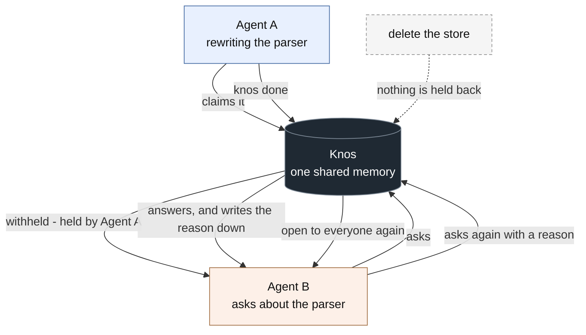

# Knos

Two agents are open on the same repo. Claude Code is rewriting the parser.
Cursor, knowing nothing about that, is about to rewrite it too. Meanwhile the
decision you explained yesterday died with the session it was in, so you write
it down in `CLAUDE.md`, and again in `AGENTS.md`, and again in your editor's
rules — three copies drifting apart from the day you write them.

**Knos is one memory for every coding agent on your machine, and it knows
which of them is in your code right now.**

```bash
pip install knos
knos point .
knos ask "why did we drop redis?"
```

About fifteen seconds to the first answer, and every answer names its source:
a file and line, a session and a date, or a commit. No account, no key, no
server, no config file.

Then give your other agent the same memory, once:

```bash
knos connect --write
```

Restart it and both know everything. Nothing to keep in sync, and nothing
leaves this machine.

<sub>For answers that name a file and line, Knos uses
[universal-ctags](https://github.com/universal-ctags/ctags) if you have it:
`winget install UniversalCtags.Ctags`, `brew install universal-ctags`, or
`sudo apt install universal-ctags`. Without it you still get every answer from
your sessions and commits.</sub>

---

## Core flow

The part a markdown file cannot do. Longer walkthrough in
[docs/core-flow.md](docs/core-flow.md).



1. **An agent claims work.** It says what it is about to do. The claim lapses
   on its own after thirty minutes.
2. **The next agent is withheld.** Not warned — withheld. It gets who holds
   the work, and nothing else.
3. **Override costs a reason.** Standing down is free. Taking the work anyway
   is written down permanently, under that agent's name.
4. **`knos done` releases it.** What happened stays written down.
5. **Delete the store and it all goes.** One SQLite file, no second copy.

Knos cannot stop an agent editing a file — it has no authority over an editor,
and any tool claiming otherwise is not telling you the truth. What it owns is
what it knows, and on contested work it declines to be the source.

---

## What an answer looks like

Knos has no model. It does not write prose, and it does not summarise. An
answer is what was actually said or committed, and under it, where that came
from:

```
$ knos ask "why did we change the vercel build"

Vercel ships its own pnpm which rejects lockfileVersion 9.0; installing a
version globally does not change which binary the build shell resolves.
    commit ee0b903f 2026-08-19
```

Sometimes the answer needs two sources at once — a session that says *why*
and a commit that says *what* — and neither one alone will do:

```
we agreed to move the retry logic out of src/auth.py because it was
retrying the password check as well as the token refresh
    and src/auth.py changed: Split token refresh out of login
    Claude Code session beef0001 2026-08-21, then commit 4c11ade0 2026-08-22
```

## Seeing it work

```
knos status

  journal    474 things learned      appended, never rewritten
  warm       12 things named         replaced in place
  hot        2 claimed               one each, expires after 30 min
  reference  your-repo               written once, when read
  archive    1 forgotten             on knos forget
             1.9 MB of 5 MB used

  who stood down for whom, while a claim was live
    Cursor stood down for Claude Code on parser
    Cursor took deploys anyway: the build is broken
```

Five kinds of memory, each behaving differently, all in one SQLite file on
your machine. The full walkthrough is in [docs/core-flow.md](docs/core-flow.md).

## What it can see

| Source | Read from |
|---|---|
| Agent sessions | Claude Code transcripts, Cursor's history |
| What you told it | `knos remember`, and your agents' `remember` tool |
| Commits | `git log`, who changed what and when |
| Code structure | [universal-ctags](https://github.com/universal-ctags/ctags), if installed |

## What your agents cannot see

`.env`, `*.pem`, `id_rsa`, `.ssh`, `.aws` and twelve more are private the
moment Knos reads a repo. Nobody has to ask for that.

Private means invisible, not redacted. An agent asking about a private path
is told nothing — no result, no count, no "2 hidden". You can still search
all of it yourself.

```bash
knos private notes/salary.md
```

## Sharing a folder with a teammate

```bash
knos share ./src --with alice.base.eth
knos unshare ./src --with alice.base.eth
```

Their agent can read that folder and nothing else — not the rest of the
repo, and never your secrets. After the second command, the same question
comes back with nothing.

The record of who may read what is
[Access.sol](contracts/src/Access.sol) on Base Sepolia, so neither of you has
to trust the other's copy of it. It is testnet only and costs nothing, and
none of that is your teammate's problem: they see a name and a folder.

**The whole cycle, in order.** The two `knos` commands each send one
transaction to Base Sepolia and wait for it to settle before returning, so
what the middle step sees is the truth and not a stale read.

```bash
knos share crates --with 0xTEAMMATE     # grant, ~3s
#   their agent now asks its own client:
#   search("risk guard", on_behalf_of="0xTEAMMATE")   -> answers from crates/
knos unshare crates --with 0xTEAMMATE   # revoke, ~4s
#   the same question now returns: Nothing shared with you.
```

The teammate's read goes through their agent rather than the command line:
`on_behalf_of` is an argument to the `search` tool, and there is deliberately
no flag that lets you impersonate somebody from your own shell.

**Or verify without running anything.** The contract is
[`0x955fa320…6E52`](https://sepolia.basescan.org/address/0x955fa320D60D9172CF048141ed7eEE442da66E52)
on Base Sepolia, and one full grant-then-revoke cycle is on chain:

| | |
|---|---|
| [deploy](https://sepolia.basescan.org/tx/0xdcc25ff7460a09a080ec32016b39121b6a34b741f03411bcfdc2ee2a93b31d21) | `0xdcc25ff7…` |
| [grant](https://sepolia.basescan.org/tx/0x84e11e21315b51e9e6b6453d226a44bcabf5a80f4c0085ba6f5b56ed169a92b6) | `0x84e11e21…` |
| [revoke](https://sepolia.basescan.org/tx/0xb3ea6920c0a7bf7fa9dde64e6f0c2275e149f976bf20c909098a2431417adfb4) | `0xb3ea6920…` |

Between the second and the third, a teammate's agent could read the shared
folder. After the third, the same question returned nothing. The permission
itself is OpenZeppelin's `AccessControl`; the contract only names the roles.
Nine tests: `cd contracts && forge test`. More in
[contracts/README.md](contracts/README.md).

## Selling an answer

Knos is registered on the Virtuals agent marketplace as a provider, so another
agent can pay it a hundredth of a dollar to answer a question from this
machine's memory. One offering. No evaluator, no reputation system.

| | |
|---|---|
| Agent | [Knos](https://app.virtuals.io/acp/agents/01a05b97-a776-760a-9165-e9893e4091dc) |
| Agent ID | `01a05b97-a776-760a-9165-e9893e4091dc` |
| Wallet | [`0xd535a882…e0de`](https://basescan.org/address/0xd535a8828ffd79c12622313cb55e37d86302e0de) on Base |

The agent page is public: open it and you will see the registration without
running anything. The seller half is [agent/offering.ts](agent/offering.ts) —
it prices a job, waits for it to be funded, asks Knos, and submits whatever
Knos found, sources and all. A question outside what it knows is answered
honestly and still charged, because finding out that a door is shut is worth
what it costs to knock.

The provider is wired and connects. Fill in `~/.knos-keys/acp.json` with the
wallet id and signer from the agent's Signers tab, then:

```bash
cd agent && npm install && npm run register
# knos is answering questions at 0.01 USDC each.
```

It then waits for jobs: it prices one, waits for it to be funded, asks Knos,
and submits what Knos found with its sources. A question outside what it knows
is answered honestly and still charged, because finding out that a door is
shut is worth what it costs to knock.

**No job has been traded through it yet**, because that needs a buyer. What
you can check today is the agent page above and that the provider starts and
listens.

## Where the memory lives

`~/.knos/<repo>/memory.db`, a SQLite file, via
[Sibyl](https://github.com/Sibyl-Labs/Sibyl-Memory). Nothing leaves this
machine: Knos makes no network request, and neither does the code reader.
Knos runs Sibyl **unactivated**, which means no account and no server call,
and holds 5 MB per repo. When that fills, Knos keeps the newest and tells
you.

The five tiers, each doing a different job — a **journal** of what was
learned and where from, appended and never rewritten
([memory.py:142](src/knos/memory.py#L142)); one **warm** record per thing,
replaced in place ([memory.py:179](src/knos/memory.py#L179)); **hot** claims
of what is being worked on now, one per piece of work, which expire
([memory.py:270](src/knos/memory.py#L270)); **reference** facts that do not
change ([memory.py:405](src/knos/memory.py#L405)); and **archive**, where
forgetting puts things ([memory.py:203](src/knos/memory.py#L203)).

## Nothing runs itself

There is no watcher, no daemon, no schedule and no background job. `knos
point` reads when you run it. Every answer is a reply to something a person
did.

## Tests

**157 passing** (`pytest`) and **9 more** for the contract (`cd contracts && forge test`).

Including the two that matter: a conflicting write from a **second process**
rejected by the schema rather than by knos
([test_memory.py](tests/test_memory.py)), and a private path invisible to a
query made **directly against the search layer** with an agent's identity
([test_private.py](tests/test_private.py)). Plus a fact written by one agent
and recalled by a **separate, fresh** process ([test_recall.py](tests/test_recall.py)).

## What it cannot do

- No Gemini CLI or Codex history yet. Claude Code and Cursor only.
- A claim withholds what knos knows; it cannot stop an agent editing the
  file. Nothing on your machine can, short of file permissions.
- It does not write the answer for you. It finds the passage and names the
  source; the reasoning is yours, or your agent's.
- It does not watch files. Run `knos point` again to catch up.
- 5 MB per repo.
- It has never seen a repo it was not pointed at.
- The Virtuals provider runs and listens, but no job has been traded through
  it yet: that needs a buyer, not more code.

## Licence

MIT.
