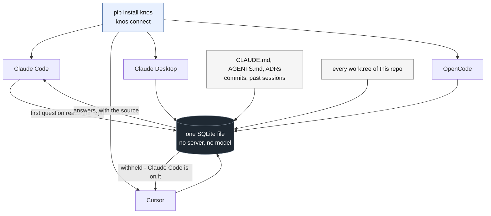

# Knos

<!-- mcp-name: io.github.drexthealpha/knos -->

[](https://glama.ai/mcp/servers/drexthealpha/Knos)

**A local MCP server that gives every coding agent on your machine one shared
memory — and it knows which of them is in your code right now.**

```bash
pip install knos && knos connect
```

Three MCP tools over stdio — `search`, `about`, `remember`. No HTTP server,
no ports, no account, no model download, no repo to register, and
[no network connection at all](tests/test_no_network.py): that last one is a
test, not a promise.

`knos connect` adds Knos to **Claude Code**, **Claude Desktop**, **Cursor**
and **OpenCode** — whichever you have, each in the shape it reads
(`mcpServers` for the first three, `mcp` with `"type": "local"` for
OpenCode). For Claude Code it runs `claude mcp add --scope user`, which
registers the server with the session you are already in, so **its tools work
immediately with nothing to restart**.

For the other three, `knos connect` writes the config and takes a backup, and
then there is exactly one thing left to do:

| Client | What is left | Why |
|---|---|---|
| Claude Code | nothing | `claude mcp add --scope user` registers with the running session |
| Cursor | **Restart Cursor.** | reads `~/.cursor/mcp.json` at startup; no command registers a server with a running instance |
| Claude Desktop | **Restart Claude Desktop.** | same |
| OpenCode | **Restart OpenCode.** | `opencode mcp add` exists but is interactive, and its docs describe no reload for a running session |

Every file it touches is copied to `<name>.before-knos` first.

<details>
<summary>Other ways in — Claude Desktop extension, Claude Code plugin, or by hand</summary>

**Claude Desktop:** download `knos.mcpb` from
[Releases](https://github.com/drexthealpha/Knos/releases) and double-click it.

**Claude Code plugin:**

```
/plugin marketplace add drexthealpha/Knos
/plugin install knos@knos
```

**By hand** — `knos connect --print` shows the JSON, or add it yourself:

```json
{ "mcpServers": { "knos": { "command": "python", "args": ["-m", "knos.mcp"] } } }
```

Every path runs the same `python -m knos.mcp`, so `pip install knos` comes
first whichever you pick.
</details>

The first thing an agent asks about a repo reads it. Seven cold runs each,
whole process, Windows on a spinning disk (WSL on the same box: 3.4s median on a small repo): **1.7s median on a small project (1.5-2.1),
2.0s on goose (1.8-3.4), 3.1s on the Linux kernel (3.0-6.8)** — 93,703 tracked
files. What it does in that time is one `git log`, your `CLAUDE.md`, and the
transcripts of past sessions in that tree, written to SQLite. It happens once. Every question after it is
under 0.2s, and every agent you have shares the result.

## The one thing nothing else does

Claude Code is rewriting the risk guard. You ask Cursor about it.

Every other memory tool answers, and Cursor gives you a confident plan built
on the version that was on disk five minutes ago. Knos does this instead:

```
Withheld. risk guard (held by Claude Code) is being worked on right now,
so knos is not the place you find out about it. Ask them, or work on
something else.
```

Not a warning attached to the answer — **no answer**. Your agent can still
take it, by saying why, and the reason is written down under its name where
you will read it. `knos done` releases it, and so does half an hour.

Every cell below comes from that tool's own README or documentation page, so
you can check each one:

| | To install | MCP tools | Needs | Refuses to answer about work another agent claimed |
|---|---|---|---|---|
| `CLAUDE.md` + worktrees | — | — | nothing | no |
| [agentmemory](https://github.com/rohitg00/agentmemory) | `npx -y @agentmemory/agentmemory@latest` | **54** (8 in core mode) | a server on ports 3111/3112/3113/49134 | no — `memory_lease` locks an *action* an agent chooses to take |
| [mcp-local-memory](https://github.com/Beledarian/mcp-local-memory) | npx entry in your config | 18 | may download an embedding model | no |
| [Engram](https://github.com/Gentleman-Programming/engram) | `brew install` + `engram setup <agent>` | 16 | nothing — one binary | not addressed |
| [MemPalace](https://github.com/MemPalace/mempalace) | `uv tool install mempalace` + `init` + `mine` | 45 | ~300 MB embedding model | no — separate wings per agent |
| [Hindsight](https://github.com/vectorize-io/hindsight) | `docker run …` or pip | 3 per bank | Postgres + pgvector + an LLM API key | no — banks are isolated by design |
| [Vibsync](https://vibsync.com/agent-coordination) | remote MCP URL + an account | claim/release, check_conflicts, remember/recall, task board | a hosted server | no — its own page: "cooperative, not enforced — a rogue agent can still ignore it" |
| [CoordMCP](https://glama.ai/mcp/servers/siddiquesahabaj/CoordMCP) | `pip install coordmcp` | **52** | a coordination server running | no — `lock_files` blocks edits, not reads |
| [Memryzed](https://github.com/memryzed/memryzed) | `curl -fsSL https://memryzed.com/install.sh \| bash` | 9 | nothing — one SQLite file | not addressed |
| [Agent Claim MCP](https://glama.ai/mcp/servers/vk0dev/agent-claim-mcp) | npx entry in your config | 3 | nothing | no — and it is not a memory system: claims only, no sessions or decisions |
| **Knos** | **`pip install knos && knos connect`** | **3** | **nothing** | **yes** |

Knos is not the only tool with claims, and that column would be dishonest if
it implied so. Vibsync, CoordMCP, AgentRoom and Agent Claim MCP all let an
agent claim something; agentmemory has leases. The difference is what a claim
*does*. Everywhere else it is a signal about a file, which an agent may check
before editing and may ignore — Vibsync says so itself, and CoordMCP's locks
stop edits while the memory stays fully readable. Knos changes what the memory
says: ask about work someone else claimed and there is no answer to act on,
and the claim is bound to the connection that made it, so an agent naming
itself the holder is still refused.

Two of these are worth your attention for reasons other than that column.
Memryzed is local, keyless and one SQLite file — the same shape as Knos, with
more recall tools and no coordination. Vibsync is the only one that shares a
claim across machines, which Knos does not: a committed `.knos/decisions.md`
is as far as a claim travels here.

Knos is not trying to out-remember these tools. It is trying to be the one
that speaks up while two agents are in the same code, and to cost you two
commands and three tools to find out.

## One agent is enough to see it

```bash
knos claim "the parser"
```

Ask your agent about the parser. It is refused, and tells you so. `knos done`
and it answers again. That is the whole mechanism, in two commands.



## Share it with the repo, not a server

Everything above is local. Two things, though, exist nowhere a teammate can
reach — what somebody decided, and what somebody is working on right now. So
those go in the repository, as a file you commit:

```bash
knos export        # writes .knos/decisions.md
git add .knos && git commit -m "share decisions"
```

That one file is the whole mechanism. It is markdown, it diffs in review, and
three different kinds of reader consume it without installing anything:

- **A teammate clones and asks.** `.knos/decisions.md` is one of the decision
  records Knos already reads, so a clean clone answers from it on its first
  question — no install, no sync, no account, no server between the two
  machines (`pytest tests/test_shared_repo.py -k second_clean_clone`).
- **Every agent on their machine reads it too**, through the same three MCP
  tools, on the same first question. A contributor who has never heard of
  Knos still gets your decisions, because their agent asks and the file is
  already in the checkout.
- **CI reads it on a pull request** and says so when the branch touches work
  somebody has claimed (`pytest tests/test_shared_repo.py -k ci_warns`).

```yaml
# .github/workflows/knos-claims.yml
on: pull_request
permissions: { contents: read, pull-requests: write }
jobs:
  claims:
    runs-on: ubuntu-latest
    steps:
      - uses: actions/checkout@v4
      - uses: drexthealpha/Knos/action@main
```

The comment is a heads-up, never a failure — `action/knos_pr_check.py`
exits 0 on every path, including when it finds a conflict and when it
crashes.

**It runs both ways, and that is the part that compounds.** The teammate who
cloned runs `knos export` too. Their decisions and their claims land in the
same file, you pull, and your agents read what they decided while you were
not looking. Every contributor writes to the file and reads from it, so it
holds more after each one than before. The repository is the shared object:
there is no database of ours, no protocol to adopt, and no server to pay
for.

Secrets do not travel: a note about `.env` is filtered out of the exported
file by the same check that hides `.env` from an agent
(`pytest tests/test_shared_repo.py -k private_note`).

**Nothing outside this repository has adopted it yet.** The loop is
implemented and tested, six tests in `tests/test_shared_repo.py`. That is a
mechanism that works, not a network that exists.

## Check any of it in under a minute

Nothing below is a claim. Each row is a command; run it and see.

| What | How to check it yourself |
|---|---|
| A claim changes what other agents are told | `knos claim "the parser"` — it prints the exact refusal your agents now get. `knos done` gives it back. |
| One agent's claim reaches another agent's **live** session, with no restart or cache | `pytest tests/test_no_network.py -k live_session` — one process claims, a second sees it on its next call |
| No network connection, ever | `pytest tests/test_no_network.py` — breaks `socket.connect`, `bind`, `create_connection`, `getaddrinfo`, then reads a repo, answers, writes, claims, withholds, overrides. A third test breaks the guard on purpose, so it cannot pass by doing nothing |
| Decisions you keep in the repo are read | `pytest tests/test_rules.py -k decisions_kept_beside` — an ADR answers with `docs/adr/0001-use-sqlite.md:3` |
| Every worktree of a repo is one memory | `pytest tests/test_worktrees.py` |
| A big repo is never half-read | `pytest tests/test_worktrees.py -k runs_out_of_time` — both readers, forced to time out, leave nothing behind |
| Secrets are invisible, not redacted | `pytest tests/test_private.py` — the search layer is asked directly, with an agent's identity |
| What dies when you delete the store | `pytest tests/test_sibyl_is_load_bearing.py -k number_status_prints` |
| Three MCP tools, no more | `pytest tests/test_recall.py -k three_tools_are_listed` |

Cost: `pip install knos`. No account, no key, no server, no model download.

## Everything else, briefly

Every answer names where it came from — a commit, a session and a date, or a
file and a line. Knos has no model: it does not summarise and it does not
guess, it finds what somebody actually said.

```
$ knos ask "what are the rules here?"

Ask before adding a dependency. The build is the product.
    AGENTS.md:3
Every change ships with a test. A green run you did not watch is not green.
    CLAUDE.md:8
```

| Source | From |
|---|---|
| Your rules | `CLAUDE.md`, `AGENTS.md` |
| Decisions in the repo | `.knos/decisions.md`, `DECISIONS.md`, `WORKLOG.md`, `docs/adr/*.md`, `docs/decisions/*.md` |
| Agent sessions | Claude Code transcripts, Cursor's history |
| Commits | `git log` |
| Code structure | read by Knos itself, or [universal-ctags](https://github.com/universal-ctags/ctags) when you have it |
| What you tell it | `knos remember` |

### What is covered, and what is not

Knos is wired into **4 clients** and reads the past session history of **2**.
Both numbers are the honest ones:

| Client | MCP tools | Reads its past sessions |
|---|---|---|
| Claude Code | yes, no restart | yes |
| Cursor | yes | yes |
| Claude Desktop | yes | no |
| OpenCode | yes | no |
| Hermes Agent | via [knos-hermes](https://github.com/drexthealpha/knos-hermes) | no |
| Gemini CLI, Codex, Windsurf, Aider, Continue | no | no |

Wiring a client is three edits and a test — [CONTRIBUTING.md](CONTRIBUTING.md)
has them, with OpenCode as the worked example. A session reader is about 40
lines; `.github/GOOD_FIRST_ISSUES.md` describes the Gemini CLI and Codex one.

**Knos does not have memory of every local workflow, and does not claim to.**

`.env`, `*.pem`, `id_rsa`, `.ssh`, `.aws` and twelve more are private the
moment Knos reads a repo, without being asked. Private means invisible, not
redacted: an agent asking about one is told nothing at all — no result, no
count, no "2 hidden".

**Worktrees.** Keep them; they do a different job, and Knos treats every
worktree of a repo as one memory anyway. Read the repo in one tree and every
other tree can answer. Claim in one and the agents in the others are held off.

The whole mechanism is one git command. `git rev-parse --show-toplevel`
returns the worktree root, so every worktree looks like a different project;
`git rev-parse --git-common-dir` returns the git directory the worktrees
share, which is identical across all of them. Knos keys the store on the
second. Tools that key on the first fragment a repo's memory once per
worktree — [that bug, in another
tool](https://github.com/rohitg00/agentmemory/issues/515). Check it:
`pytest tests/test_worktrees.py`.

**Commands.** `knos ask`, `knos claim`, `knos done`, `knos status`,
`knos export`. `knos help` lists the rest. Nothing runs itself: no watcher,
no daemon, no schedule.

### Speed, on the one question this is for

"What was decided, and is anyone on it?" — warm, whole process, median of 7:

| | Knos | `git log --all -S` |
|---|---|---|
| small repo | 960ms | **33ms** |
| Linux kernel (93,703 files) | **920ms** | 28,289ms |

Git wins on a small repo and it is not close. Knos's time is flat with repo
size because it reads an index rather than walking history; git's grows with
it. On the kernel that is 30x, and most of Knos's 900ms is Python starting up.

**Knos is not faster than git at anything git is for**, and a cold first read
of a large repo is slower than either — 3.1s median, stated above.

**What agents actually read.** A study of 557 agent sessions and
33,097 pull requests found that **60.5%** of everything coding agents do with
documentation happens in instruction files and their own notes — `CLAUDE.md`,
`AGENTS.md`, plans, scratch notes — against 10.6% for classical docs and 1.3%
for API references ([Gao & Chen, 2026](https://arxiv.org/abs/2608.20195)).
The same paper says the link between what agents consult and what they edit
is unresolved, so this measures where agents spend their documentation time,
not that Knos is needed. What is separately true: none of those files can say
who is reading them, or what another agent is changing right now.

## What happens when you delete the memory

One SQLite file at `~/.knos/<repo>/memory.db`, via
[Sibyl](https://github.com/Sibyl-Labs/Sibyl-Memory), **capped at 5 MB per
repo** — Sibyl's free tier, and Knos runs it unactivated, so there is no
account to make and no cap to raise. Sessions and commits are read newest
first, so when a repo fills, what you have is the recent end of both and the
older end was never read. Nothing already stored is evicted or truncated, and
`knos status` says `nearly full` from 4 MB. The Linux kernel filled 0.3 MB.

Nothing leaves this machine — Knos makes no network request. Delete that
file and:

| | Gone forever | Why |
|---|---|---|
| What you told it (`remember`) | **yes** | it existed nowhere else |
| Every claim, and the withholding | **yes** | same |
| Who stood down for whom, every override | **yes** | same |
| Your commits, `CLAUDE.md`, past sessions | no — re-read | they are your files, not Knos's |

`knos status` counts that first row for you, so you never take it on trust:

```
journal    330 things learned
             0 of them exist nowhere else - told, claimed, stood down
             delete the store and only those go; the rest is re-read from your repo
```

Ten seconds to prove it: claim something, watch an agent be refused, delete
the file, ask again. Nothing was ever held.

More on the five tiers, why a claim expires, and how a hold is bound to a
connection so an agent cannot borrow somebody else's name:
[docs/core-flow.md](docs/core-flow.md).

## The two onchain parts, and exactly what they are

Both are optional. Knos works with neither, and nothing on the read or answer
path touches a network — that is what `pytest tests/test_no_network.py`
checks.

### Base: sharing one folder with a teammate

```bash
knos share ./src --with alice.base.eth
knos unshare ./src --with alice.base.eth
```

**What it does.** Their agent can read that folder and nothing else. The
record of who may read what is [Access.sol](contracts/src/Access.sol) on Base
Sepolia, so neither machine has to trust the other's copy of the answer.
Testnet, so it costs nothing.

**What it does not do.** It does not move your memory anywhere — the store
stays on your disk. It does not encrypt anything. It is one permission bit
per person per folder, not a sync protocol.

**How to verify it.** Two commands and one number each way:

```bash
python -c "from knos import team; o=team.identity('owner').address; m=team.identity('teammate').address; \
team.share('crates','teammate'); print(team.may_read(o,'crates',m)); \
team.unshare('crates','teammate'); print(team.may_read(o,'crates',m))"
# True
# False
```

Or read it without running anything: contract
[`0x955fa320…6E52`](https://sepolia.basescan.org/address/0x955fa320D60D9172CF048141ed7eEE442da66E52),
and one full cycle —
[deploy](https://sepolia.basescan.org/tx/0xdcc25ff7460a09a080ec32016b39121b6a34b741f03411bcfdc2ee2a93b31d21),
[grant](https://sepolia.basescan.org/tx/0x84e11e21315b51e9e6b6453d226a44bcabf5a80f4c0085ba6f5b56ed169a92b6),
[revoke](https://sepolia.basescan.org/tx/0xb3ea6920c0a7bf7fa9dde64e6f0c2275e149f976bf20c909098a2431417adfb4).
Nine contract tests: `cd contracts && forge test`.

### Virtuals: selling one answer

**What it does.** Knos is registered on the Virtuals marketplace as a
provider with one offering: another agent pays 0.01 USDC for an answer out of
this machine's memory. The seller is [agent/offering.ts](agent/offering.ts).

**What it does not do.** There is no evaluator and no reputation system, and
**the three jobs traded through it were all bought by a test agent of mine,
not by a customer.** It is off by default and runs only when you start it.

**How to verify it.** The agent page is public — open
[app.virtuals.io/acp/agents/01a05b97…](https://app.virtuals.io/acp/agents/01a05b97-a776-760a-9165-e9893e4091dc)
and you will see the registration without installing anything. Job 75659 is
on Base mainnet, in two legs, neither of which needs an account to read:
[buyer pays 0.01 USDC into escrow](https://basescan.org/tx/0x756b867b2b1165bfe674025a82d21cd765378a40ab226274bd555abf0065bd64),
then [escrow releases 0.0095 to the provider](https://basescan.org/tx/0x95a84c44802d09e38ef920524f947dff0eb5a2fe972054fca97bfd989cbcea59)
— the missing 5% is the protocol's fee.

It was asked *why does knos withhold claimed work*, and what it sold, in
180ms, was a passage out of a session from four days earlier:

> knos withholds what it knows. A second agent searching claimed work gets
> who holds it and nothing else — the content is absent from the reply, not
> annotated.
> — Claude Code session 4101eeab 2026-08-31

Nobody re-typed that. Another agent paid a penny and a fresh process read it
back with its source. The buyer was
[knos-buyer](https://app.virtuals.io/acp/agents/01a063e1-914d-775c-ad42-74cff7881245),
an agent of mine registered to prove the path executes. It is not demand.

## Tests

**206 passing** (`pytest`), **9 more** for the contract (`cd contracts && forge test`).

Including the ones that would catch a lie:

- **[test_no_network.py](tests/test_no_network.py)** breaks `socket.connect`,
  `bind` and `getaddrinfo`, then reads a repo, answers questions, writes,
  claims, withholds and overrides. Nothing reaches for the network, and the
  guard itself is tested so the test cannot pass by doing nothing.
- **[test_private.py](tests/test_private.py)** asks the search layer directly,
  with an agent's identity, for a private path. Nothing comes back.
- **[test_memory.py](tests/test_memory.py)** has a second process write a
  conflict, rejected by the schema rather than by Knos.
- **[test_recall.py](tests/test_recall.py)** writes as one agent and recalls
  in a separate, fresh process.

## What it cannot do

- A claim withholds what Knos knows. It cannot stop an agent editing a file —
  nothing on your machine can, short of file permissions. If you need that,
  use a worktree.
- Rules are enforced **only on what Knos mediates**: recall, `remember`, and
  the claim/withhold path. Knos cannot make a foreign runtime obey your
  `CLAUDE.md`; it can only decline to be the source of truth, and say who to
  ask. No MCP server can do more than this: the protocol gives a server no
  way to intercept an edit.
- Claude Code and Cursor only. No Gemini CLI or Codex history yet.
- It does not write the answer for you, and it does not watch files. Run
  `knos point` again to catch up.
- **Retrieval is lexical, not semantic.** Sibyl searches with SQLite FTS5, so
  Knos finds passages containing your words and ranks those. Ask about
  something the sessions never discussed and you get confident, well-sourced
  passages that share a word with your question and nothing else: "why did we
  drop redis" matches every note about *dropping* something. Ask in the words
  the work was done in and it is sharp. There are no embeddings at any Sibyl
  tier — the paid tier adds summarising and a learning loop, not search.
- 5 MB per repo.
- Three jobs have been traded through the Virtuals provider, all bought by a
  test agent of mine. Nobody else has bought anything.

## Contributing

[CONTRIBUTING.md](CONTRIBUTING.md) has the three edits an agent adapter takes
and the test to copy. `pytest` runs in about four minutes against throwaway
stores.

## Licence

MIT.
