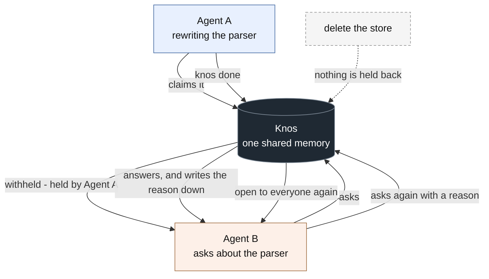

# Core flow

Two agents, one repo, neither talking to the other. This is the whole product
in one picture.



## What each step is

**Agent A claims it.** Before starting work, an agent says what it is about to
do. That is the only thing knos stores which is about *now* rather than about
what already happened, and it lapses on its own after thirty minutes.

**Agent B is withheld.** Asking about claimed work does not return the answer
with a warning attached. It returns no answer — only who holds it:

```
Withheld. parser (held by Agent A) is being worked on right now, so knos
is not the place you find out about it. Ask them, or work on something else.

If you must have it anyway, call this again with override="your reason".
That is recorded against your name.
```

knos cannot stop an agent editing a file. It has no authority over an editor,
and any tool that claims otherwise is not telling you the truth. What it does
own is what it knows, and on contested work it declines to be the source.

**Override costs a reason.** Standing down is free. Taking the work anyway
needs a reason, and the reason is written down permanently under that agent's
name, where you will read it:

```
Agent B took parser anyway: the build is broken and I need it now
```

**`knos done` releases it.** The claim goes, and so does the record of who
stood down. What happened stays written down.

**Delete the store and enforcement disappears.** There is no second copy, no
cache and no fallback file. Everything above lives in one SQLite file on your
machine. Remove it and knos answers freely again, because there was never
anything else holding it back.

## The five tiers, and why there are five

One SQLite file, but not one shape of thing in it. Each tier behaves
differently because each answers a different question, and collapsing them
into one table of rows would lose the behaviour that makes the rest of this
work:

- **Journal** — what was learned and where from, appended and never rewritten
  ([`Memory.record`](../src/knos/memory.py)). This is what an answer quotes.
- **Warm** — one canonical record per thing, replaced in place
  ([`Memory.note_thing`](../src/knos/memory.py)). What knos knows *about* a
  file or a person, rather than where it heard it.
- **Hot** — claims of what is being worked on now, one per piece of work,
  which expire ([`Memory.working_on`](../src/knos/memory.py)). The only part of
  the store that is about *now*. Everything on this page depends on it.
- **Reference** — facts that do not change ([`Memory.set_reference`](../src/knos/memory.py)).
- **Archive** — where forgetting puts things ([`Memory.supersede`](../src/knos/memory.py)),
  so a note can stop being an answer without the record of it disappearing.

A hold is bound to the connection that made it, not to the name the caller
gave. An agent that calls itself by the holder's name is still withheld,
because the claim remembers which session made it.

All of it is [Sibyl](https://github.com/Sibyl-Labs/Sibyl-Memory), run
unactivated: no account, no server call, 5 MB per repo.
